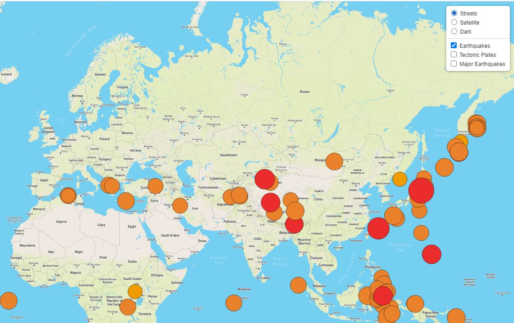
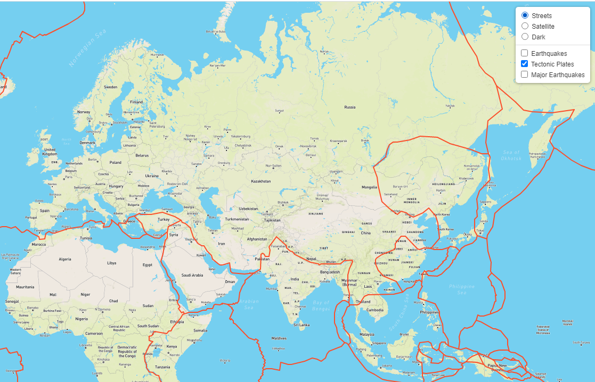
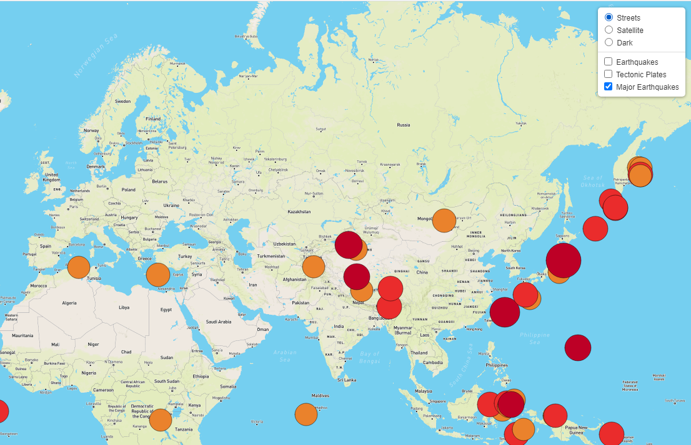

# Mapping_Earthquakes

## Project Overview

Utilizing MapBox & Leaflet to analyze the GeoJSON earthquake data from the USGS to visually present the following:

1. Differences between the magnitudes of global earthquakes for the last seven days.
2. Earthquake data in relation to the tectonic plates’ location on the earth. 
3. Earthquakes with a magnitude greater than 4.5.

## Results

The earthquakes are represented by circle markers which size and colour are relevant to its magnitude.

  

Clicking on the circle marker will open a popup containing magnitude and location details.

  

The map is also available in [Satellite](Resources/Tile_Layer_2.PNG) and [Dark](Resources/Tile_Layer_3.PNG) modes.

The map can also be filtered using the control menu at the top right corner to display any combination of the following:

#### Earthquakes over the last seven days.

  

#### Tectonic Plates

  

#### Major Earthquakes

  

